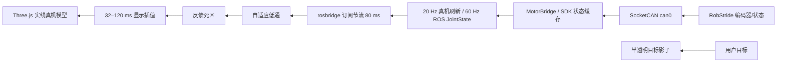
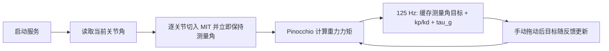
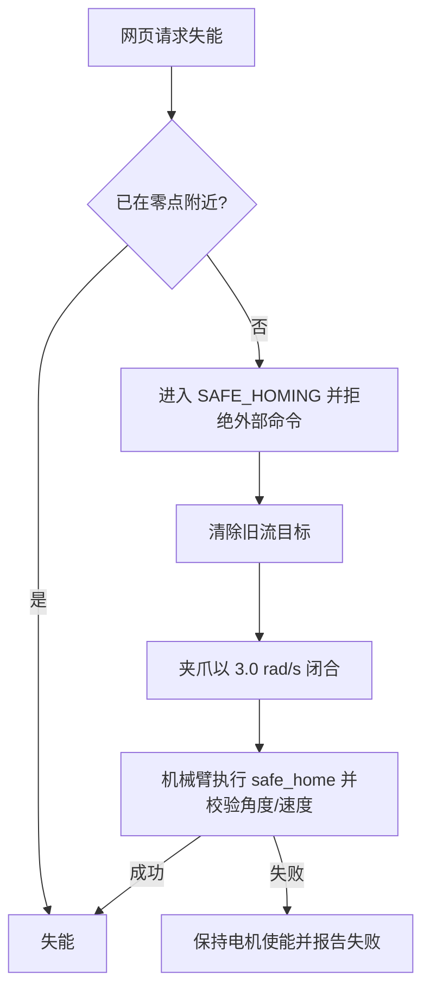

# B601-RS 数据流与处理链

本文描述“一个网页操作最终如何变成真机/仿真运动，以及反馈如何回到网页”。若出现卡顿、
不跟手、模型超前或抖动，应沿链路逐层测量，不要只靠修改单个插值参数猜测。

## 1. 真机关节滑块与 TCP 拖拽


### 浏览器侧

- 关节 1–6 滑块先经过默认 30 ms 的一阶阻尼，再以最高 60 Hz 发布。
- J7 夹爪走独立宽度通道：滑块不再量化为 1 mm 台阶，浏览器每个绘制帧只发布收到的
  最新目标，松手时立即提交最终值；不进入 J1–J6 的弧度阻尼链，也没有输入死区。发布时才把
  0–71.5 mm 换算为 0–5 rad，合法行程夹紧仍然保留。
- 关节输入死区为 1°；松手会强制提交最终值，不会永远停在阻尼中间值。
- TCP 拖拽先在浏览器内用 DLS 求逆运动学。RS 阻尼会在 0.018–0.075 之间随奇异程度
  调整，再把求出的关节目标走同一条 `JointMitCmd` 链。
- 网页速度 `vlim` 默认 1.2 rad/s，允许范围 0.05–1.5 rad/s。

### ROS 与控制器侧

- 关节话题：`/rebotarm/joints/<joint>/cmd/mit`。
- 默认仲裁策略是 `reject`：轨迹、重力补偿和安全回零期间拒绝冲突命令。
- 新目标只更新在线轨迹终点；电机发送不依赖下一帧网页消息。
- 125 Hz 控制循环根据当前参考位置、速度、加速度继续前进，约束为 4 rad/s²、
  30 rad/s³ 和消息给出的 `vlim`。
- 命令 QoS 深度为 1，新的滑块目标覆盖尚未处理的旧目标，不会松手后继续补播积压位置。
- 同步真机反馈默认 20 Hz 刷新缓存，ROS 从缓存以 60 Hz 发布；实时 MIT 循环不做同步
  CAN 参数查询。正常运动的重力前馈也基于这份缓存计算。
- 当前 MIT 增益为 `kp=[80,150,150,50,50,50]`、
  `kd=[5,10,10,5,4,4]`。

## 2. 真机反馈到网页



实线模型表示反馈，半透明模型表示尚未到达的目标。关节误差小于 0.025 rad、夹爪误差
小于 3 mm 后，目标影子会消失。真机夹爪模式不先播放命令动画，而是等待反馈，避免一次
快速打开的“鬼影”后再慢慢跟随。

反馈滤波参数：

- 位置最低截止频率：3 Hz；
- 速度估计截止频率：1 Hz；
- 速度自适应系数：4；
- 关节死区：0.0025 rad；
- 夹爪死区：0.00025 m。

控制诊断还提供三组信号：

| 话题 | 含义 |
|---|---|
| `/rebotarm/joint_states` | 电机实际反馈 |
| `/rebotarm/control_reference` | 以 ROS 状态发布率（默认 60 Hz）采样的 125 Hz 在线轨迹参考；`effort` 携带参考加速度 |
| `/rebotarm/control_target` | 网页或动作层最终目标 |

同时记录这三组数据可以判断问题在哪一层：目标阶跃说明输入层不连续；参考不连续说明轨迹
生成问题；参考连续但反馈过冲说明真机增益、负载、摩擦或电流环需要调试；只有网页画面抖动
则检查反馈滤波和 rosbridge 到达间隔。

## 3. `FollowJointTrajectory` 回放


回放段之间使用共享的单调三次 Hermite 速度，因此位置和速度在路点处连续；控制器不再
每 20 ms 把期望速度清零。回放动画不自行按录制时间“先演完”，而应显示真机反馈。
若请求的段时间不足以满足
0.60 rad/s，控制器会自动延长，所以最终实际时长可能长于原始录制时长。网页必须使用
动作反馈/关节反馈推进视觉，而不能假定请求时间就是到位时间。

## 4. 重力补偿



- 可从非零位置启动，不会把零位作为目标。
- 重复点击启动是幂等操作，只报告已经开启，不重置出一段突动。
- `status` 服务查询真实状态，而不是网页本地猜测。
- 停止时保持最后测量位置，再回到普通 MIT 位置保持。
- 重力补偿期间拒绝网页关节、TCP、轨迹和夹爪命令。

服务：

```text
/rebotarm/gravity_compensation/start
/rebotarm/gravity_compensation/stop
/rebotarm/gravity_compensation/status
```

## 5. 安全回零与失能



零点校验阈值为各关节绝对角度不超过 2°、速度不超过 0.15 rad/s。安全回零会清除上次
滑块/TCP 目标，避免下一次操作突然恢复回零前的姿态。关闭网页连接时是否回零再失能由
网页复选项决定；控制器端的安全规则不会因为关闭浏览器而绕过。

## 6. MuJoCo 仿真数据流

```mermaid
flowchart LR
    A[网页 / Agent] --> B[ROS 命令或动作]
    B --> C[Fake RS Driver 100 Hz]
    C --> D[目标 joint_states]
    D --> E[MuJoCo Sync 250 Hz]
    E --> F[RS MJCF 动力学与碰撞]
    F --> G[/mujoco/joint_states]
    F --> H[object_states 30 Hz]
    F --> I[俯视相机 8 Hz]
    I --> J[颜色检测 10 Hz]
    G --> K[网页最高 25 Hz接收]
    H --> K
    J --> L[MCP 抓取 Agent]
```

默认 `physics` 模式下，MuJoCo 机械臂采用 PD + bias/gravity 的动力学控制：

```text
kp = [80, 100, 100, 35, 25, 18]
kd = [8, 10, 10, 4, 3, 2.5]
力矩上限 = [36, 36, 36, 14, 14, 14]
```

`kinematic` 模式直接设置 `qpos`，适合接口测试，不代表真机动力学。任务服务器按 60 Hz
生成仿真动作、最大关节速度 1.0 rad/s，并使用三次 smoothstep；它和真机的 125 Hz 限
jerk MIT 控制不是同一个轨迹实现。

## 7. 命名空间

| 环境 | 默认命名空间 | 用途 |
|---|---|---|
| 真机 | `/rebotarm` | `./rebotarm start rs` |
| Fake Driver + MuJoCo | `/rebotarm_rs` | `./rebotarm start rs_sim` |

网页连接后必须选对命名空间。若仿真能动、真机不动，第一步先检查网页当前选择的是不是
`/rebotarm`，再检查 `arm_status`、命令话题订阅数和 `can0`。
